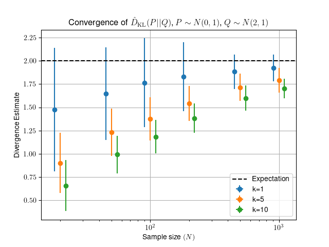

# KL divergence estimators

Here I test a few implementations of a KL-divergence estimator
based on k-Nearest-Neighbours probability density estimation.

The estimator is that of 

> Qing Wang, Sanjeev R. Kulkarni, and Sergio Verdú. "Divergence estimation for multidimensional densities via k-nearest-neighbor distances." Information Theory, IEEE Transactions on 55.5 (2009): 2392-2405.

This study is far from exhaustive, and timings are sensitive to implementation
details. Please take with a pinch of salt.

# Estimator implementations


 - **naive_estimator**

    KL-Divergence estimator using brute-force (numpy) k-NN

 - **scipy_estimator**

    KL-Divergence estimator using scipy's KDTree

 - **skl_estimator**

    KL-Divergence estimator using scikit-learn's NearestNeighbours


These estimators have been benchmarked against `slaypni/universal-divergence`.

# Tests


## 1-D self-divergence
 Estimate the divergence between two samples of size **N** and dimension
    1, drawn from the same ~ N(0,1) probability distribution.

|    Estimator    |  D(P\|Q) | Time (s)|
|-----------------|----------|---------|
|naive_estimator  | 1.595e-03|13.35594|
|scipy_estimator  | 1.595e-03|26.41331|
|skl_estimator    | 1.595e-03|37.56228|

### Convergence of estimator with *N*


## 2-D self-divergence
 Estimate the divergence between two samples of size **N** drawn
    from the same 2D distribution with
    `mean=[0,0]` and `covariance=[[1, 0.1], [0.1, 1]]`.

|    Estimator    |  D(P\|Q) | Time (s)|
|-----------------|----------|---------|
|naive_estimator  |-6.811e-04|20.18910|
|scipy_estimator  |-6.811e-04|47.07861|
|skl_estimator    |-6.811e-04|36.89601|

### Convergence of estimator with *N*


## 1-D divergence of Gaussians
 Estimate the divergence between two samples of size `N` and dimension
    1, the first drawn from N(0,1), the second from N(3,1).

|    Estimator    |  D(P\|Q) | Time (s)|
|-----------------|----------|---------|
|naive_estimator  | 3.407e+00|12.74802|
|scipy_estimator  | 3.407e+00|22.56478|
|skl_estimator    | 3.407e+00|52.48217|

### Convergence of estimator with *N*



# Generating this document

```Shell
 python run_tests.py
```

Which will then likely take some time to complete.

#### Requirements

- Python >= 3.6
- scipy, scikit-learn, jinja2 

#### Important settings

The number of resamples used to estimate uncertainties is defined by
`n_resamples` in `tests.py`. This is naturally an *extremely* sensitive variable
for how long the tests take to run.
