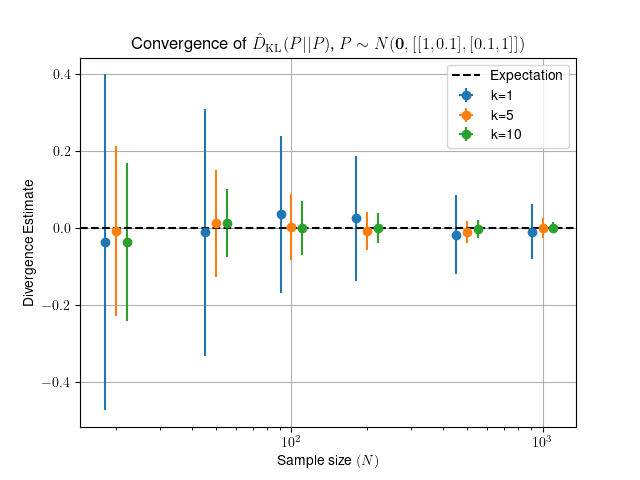

# KL divergence estimators

The [KL-divergence](https://en.wikipedia.org/wiki/Kullback%E2%80%93Leibler_divergence)
is normally defined between two probability distributions. In the case where
only samples of the probability distribution are available, the KL-divergence can
be estimated in a number of ways.

Here I test a few implementations of a KL-divergence estimator based on
k-Nearest-Neighbours probability density estimation.

The estimator is that of 

> Qing Wang, Sanjeev R. Kulkarni, and Sergio Verdú. 
> "Divergence estimation for multidimensional densities via k-nearest-neighbor distances." 
> Information Theory, IEEE Transactions on 55.5 (2009): 2392-2405.

Samples are drawn from various test distributions, and the estimated
KL-divergence between them is computed. Uncertainties are assessed by
re-sampling the distributions and re-computing divergence estimates 100 times.
Uncertainty bands are then given as the interval containing 68% of the
re-sampled estimates closest to the median. Timings where provided are the time
taken for the computation of all 100 re-samples on a sample size of **N**=1000
with **k**=5.

This study is far from exhaustive, and timings are sensitive to implementation
details. Please take with a pinch of salt.

# Estimator implementations


 - **naive_estimator**

    KL-Divergence estimator using brute-force (numpy) k-NN

 - **scipy_estimator**

    KL-Divergence estimator using scipy's KDTree

 - **skl_estimator**

    KL-Divergence estimator using scikit-learn's NearestNeighbours


These estimators have been benchmarked against [slaypni/universal-divergence](https://github.com/slaypni/universal-divergence).

# Tests


## 1-D self-divergence
 Estimate the divergence between two samples of size **N** and dimension
    1, drawn from the same ~ N(0,1) probability distribution.

***Expectation: 0***

#### Comparison of estimator implementations 

|    Estimator    |  D(P\|Q) | Time (s)|
|-----------------|----------|---------|
|naive_estimator  | 2.032e-02|1.31433|
|scipy_estimator  | 2.032e-02|2.62308|
|skl_estimator    | 2.032e-02|3.69682|

#### Convergence of estimator with *N*


## 2-D self-divergence
 Estimate the divergence between two samples of size **N** drawn
    from the same 2D distribution with
    `mean=[0,0]` and `covariance=[[1, 0.1], [0.1, 1]]`.

***Expectation: 0***

#### Comparison of estimator implementations 

|    Estimator    |  D(P\|Q) | Time (s)|
|-----------------|----------|---------|
|naive_estimator  |-1.156e-04|1.76665|
|scipy_estimator  |-1.156e-04|3.96410|
|skl_estimator    |-1.156e-04|3.99259|

#### Convergence of estimator with *N*



## 1-D divergence of Gaussians
 Estimate the divergence between two samples of size `N` and dimension
    1, the first drawn from N(0,1), the second from N(2,1).

***Expectation: 2.0***

#### Comparison of estimator implementations 

|    Estimator    |  D(P\|Q) | Time (s)|
|-----------------|----------|---------|
|naive_estimator  | 1.811e+00|1.31149|
|scipy_estimator  | 1.811e+00|2.43307|
|skl_estimator    | 1.811e+00|3.69075|

#### Convergence of estimator with *N*


# Generating this document

```Shell
 python src/run_tests.py
 cat templates/header.md report.md templates/footer.md > README.md
```

Which will then likely take some time to complete.

#### Requirements

- Python >= 3.6
- scipy, scikit-learn
- matplotlib, jinja2

#### Important settings

The number of resamples used to estimate uncertainties is defined by
`n_resamples` in `tests.py`. This is naturally an *extremely* sensitive variable
for how long the tests take to run.

